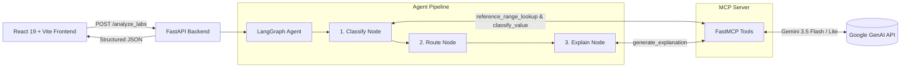

# 🧪 Clinical Lab Results Analyzer (Explainable AI + MCP + LangGraph)

An end-to-end full-stack clinical intelligence system that ingests laboratory results, classifies values against reference ranges, routes findings by clinical severity, generates **Explainable AI (XAI)** medical insights, and suggests actionable next steps.

---

## 🌟 Key Capabilities

1. **Intelligent Lab Ingestion**: Accepts clinical lab records via dynamic manual entry or CSV drag-and-drop file upload.
2. **MCP (Model Context Protocol) Architecture**: Centralized FastMCP server providing reference range lookups, unit normalization, qualitative/quantitative boundary classification, and AI explanation generation.
3. **LangGraph Agent Workflow**: Deterministic DAG orchestrating `Classify Node` → `Route Node` → `Explain Node`.
4. **Explainable AI (XAI)**:
   - Compares observed values directly against clinical reference intervals.
   - Explains the underlying physiological mechanisms and potential disease states in clear clinical terminology.
   - Highlights associated patient symptoms.
5. **Actionable Next Steps**: Generates tailored next steps (e.g., immediate emergency department referrals, specialist consults, repeat testing intervals, diagnostic workups).
6. **Clinical UI**: Modern healthcare-themed dashboard with glassmorphism, 1-click test presets (*Normal*, *Warning*, *Critical*), live metric counters, and severity filters.

---

## 🏗️ System Architecture



---

## 🚀 Tech Stack

- **Frontend**: React 19, Vite, Lucide Icons, Vanilla CSS (Clinical Slate Design System)
- **Backend API**: Python 3.12+, FastAPI, Uvicorn, Pydantic
- **AI Agent**: LangGraph, LangChain Core
- **Tool Protocol**: FastMCP (Model Context Protocol over stdio)
- **LLM Engine**: Google GenAI (`gemini-3.5-flash-lite` / `gemini-3.5-flash` with multi-model failover)

---

## 📋 Getting Started

### Prerequisites
- Python 3.10+
- Node.js 18+ and npm
- Gemini API Key

### 1. Backend Setup

```bash
# 1. Clone repository
git clone https://github.com/dev-anshu-singh/Aragen_Hackathon.git
cd Aragen_Hackathon

# 2. Create and activate virtual environment
python -m venv venv
# On Windows:
.\venv\Scripts\Activate.ps1
# On Linux/macOS:
# source venv/bin/activate

# 3. Install backend dependencies
pip install -r backend/requirements.txt

# 4. Configure environment variables
# Create .env in the root directory:
echo "GEMINI_API_KEY=your_gemini_api_key_here" > .env

# 5. Start the FastAPI server
python -m uvicorn backend.main:app --host 127.0.0.1 --port 8000
```

### 2. Frontend Setup

```bash
# In a new terminal:
cd frontend

# 1. Install dependencies
npm install

# 2. Start Vite development server
npm run dev
```

Open `http://localhost:5173` in your browser.

---

## 🧪 Test Datasets & Verification

Three synthetic clinical panels are included in `test_data/`:

| Dataset | Description | Expected Findings |
|---|---|---|
| [`test_data/normal_panel.csv`](test_data/normal_panel.csv) | 11 routine baseline tests | 0 Critical, 0 Warning, 11 Normal |
| [`test_data/warning_panel.csv`](test_data/warning_panel.csv) | Prediabetes, subclinical thyroid, mild anemia | 0 Critical, 8 Warning, 0 Normal |
| [`test_data/critical_panel.csv`](test_data/critical_panel.csv) | Severe anemia (Hb 5.8), DKA glucose (480), thrombocytopenia | 8 Critical, 0 Warning, 0 Normal |

*Tip: You can load these panels in 1 click using the **Quick Demo Presets** bar at the top of the web UI!*

---

## 📂 Project Structure

```text
Aragen_Hackathon/
├── backend/
│   ├── agent/
│   │   ├── graph.py             # LangGraph DAG (Classify -> Route -> Explain)
│   │   └── state.py             # TypedDict state definitions
│   ├── mcp_server/
│   │   └── server.py            # FastMCP server with clinical tools
│   ├── main.py                  # FastAPI REST endpoints & CORS
│   └── requirements.txt         # Python dependencies
├── frontend/
│   ├── src/
│   │   ├── components/
│   │   │   ├── Header.jsx       # Navbar & backend status
│   │   │   ├── SamplePresets.jsx# 1-click test panel loaders
│   │   │   ├── CsvUploader.jsx  # Drag-and-drop CSV parser
│   │   │   ├── LabEntryForm.jsx # Dynamic manual entry queue
│   │   │   ├── SummaryBanner.jsx# Metrics & critical alert banner
│   │   │   ├── SeverityFilter.jsx# Severity tab filter
│   │   │   └── ResultCard.jsx   # Explainable AI detail card
│   │   ├── App.jsx              # Main UI coordinator
│   │   ├── App.css              # Component styling
│   │   └── index.css            # Clinical theme & tokens
│   ├── index.html               # Typography & metadata
│   └── vite.config.js           # Vite dev proxy configuration
├── test_data/                   # Sample CSV panels
│   ├── normal_panel.csv
│   ├── warning_panel.csv
│   └── critical_panel.csv
└── README.md
```
